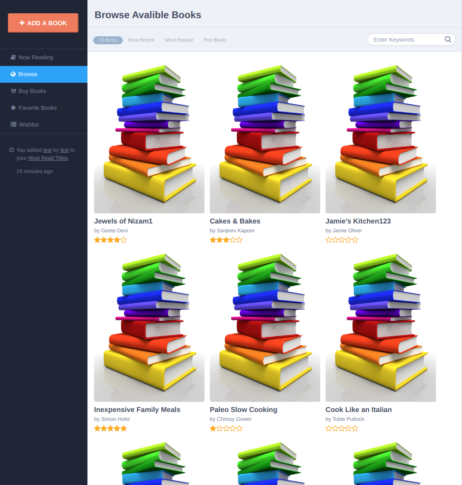

# React-Redux Books App

React test project for show books list.



## Stack

- React
- Redux
- SASS

## Functional
- read books list from `src/storage/books.js`
- redux
    - filter book
    - add new book on modal window
    - edit book on modal window
    - action history list on left panel
    - notification modal
- handmade resizeable styles

## Installation

Install with [npm](http://www.npmjs.com/):

```sh
$ npm install
```
or with [yarn](https://yarnpkg.com/)
```sh
$ yarn install
```

## Developing

Run develop with command

>`npm start`

Navigate to `http://localhost:3000/`.

Get prod builded files with command
>`npm run build`
